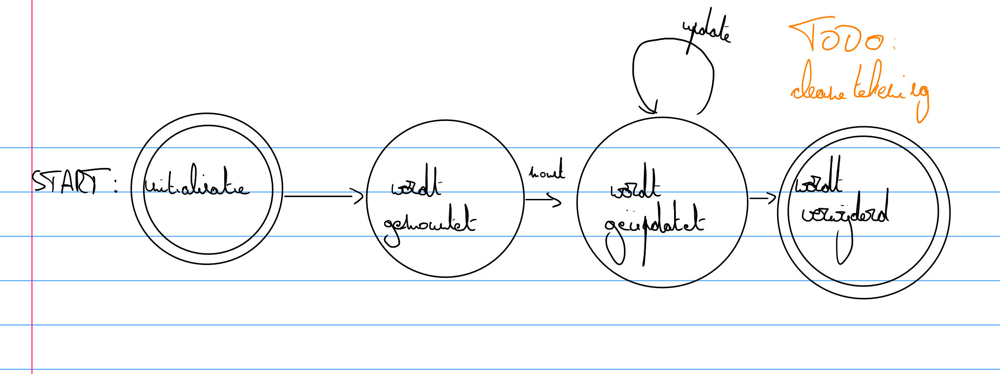

# de plaats van hooks in de component lifecycle

React genereert HTML de components voorstelt. Het genereren van de HTML op basis van de input en interne toestand heet **renderen**. In de IT-context betekent het **"een voorstelling genereren"**.

Dit renderen gebeurt in veel voorbeelden gewoonweg wanneer nodig, maar er zit een logica achter. Om te begrijpen hoe components zich gedragen, moet je op de hoogte zijn van de component lifecycle. Onderstaande voorstelling geeft een uitgezoomd perspectief:

Een component wordt eerst geïnitaliseerd. In deze fase worden o.a. de beginwaarden van de interne toestand vastgelegd. Daarna wordt hij **gemountet** (in het Engels: **mounted**). Dit betekent dat hij in de pagina wordt opgenomen. Dan kan hij gerenderd worden.

Wanneer dat gebeurd is, wordt hij typisch meermaals **geüpdatet**. Dit gebeurt in twee situaties:

* wanneer de props van de component wijzigen
* wanneer de interne toestand van de component wijzigt

Na een update wordt hij opnieuw gerenderd.

Als de component uit het document gehaald wordt, wordt hij **geünmountet** (in het Engels: **unmounted**). Daarna kan hij niet meer gebruikt worden.

Onderstaande CodePen demonstreert wat dit betekent voor de uitvoering van code:

TODO: [https://github.com/AP-IT-GH/demonstratie-react-component-lifecycle-afstandstraject/commit/57df710d7e868573714f16df53262e0625805df4](https://github.com/AP-IT-GH/demonstratie-react-component-lifecycle-afstandstraject/commit/57df710d7e868573714f16df53262e0625805df4) in CodePen zetten

De code in de body van `useEffect` loopt na elke render (dus na het mounten en na elke update) en de teruggegeven callback wordt uitgevoerd voor elke update en voor het unmounten. Merk ook op dat het aantal clicks van het conditioneel ingesloten element telkens gereset wordt wanneer het element opnieuw verschijnt.
