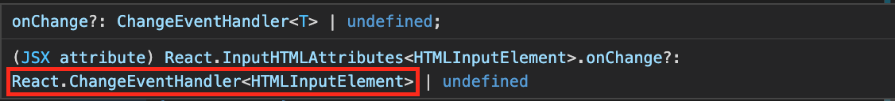

# 05. event handling

### Events afhandelen

We gaan nu eens kijken hoe we onze applicatie iets interactiever kunnen maken door de hand van invoer velden en handler functies. We gaan nu een nieuwe component introduceren genaamd `InputView`. Deze staat toe een naam en een jaartal in te vullen.

```typescript
const InputView = () => {
  return (
    <div>
      <input type="text" id="name" />
      <input type="number" id="year" name="year" min="1900" max="2021" />
      <input type="button" id="submit" value="Add" />
    </div>
  )
}
```

Hier hebben we één tekstveld voor de naam van de film en een numeriek invoerveld voor het jaartal. We zetten hier een maximum 2021 en een minimum van 1900. Tot nu toe wordt er nog niets gedaan met deze invoervelden.&#x20;

Om hier iets mee te doen, maken we een functie om iets te doen wanneer er iets ingetypt wordt in het invoerveld. Dit soort functie is een **event listener**. Verderop in de code zullen we er voor zorgen dat deze functie loopt zodra een bepaald type gebeurtenis (event) zich voordoet.

```typescript
const handleChange = (event) => {
  console.log(event.target.value);
}
```

Je compiler zal waarschuwen dat `event` nog geen type heeft. TypeScript kan uit de definitie niet automatisch afleiden welk type dit event heeft. We zullen dit dadelijk oplossen. Als we deze event listener functie willen gebruiken wanneer de invoer verandert, moeten we de functie invullen als waarde van de `onChange` property van de `input` tag.

```typescript
<input type="text" id="name" onChange={handleChange}/>
<input type="number" id="year" name="year" min="1990" max="2021" onChange={handleChange}/>
```

We kunnen de gewenste interface van de `handleChange` functie hierboven te weten komen door de muis over de onChange property te plaatsen. Je krijgt dan iets gelijkaardig aan:



We kunnen nu de signatuur `andleChange` aanpassen om de waarschuwing van hierboven op te lossen.

```typescript
const handleChange : ChangeEventHandler<HTMLInputElement> = (event) => {
  console.log(event.target.value);
}
```

We kunnen op dezelfde manier een functie maken om een click af te handelen:

```typescript
const handleClick : MouseEventHandler<HTMLInputElement> = (event) => {
  console.log("button clicked");
}
```

Het type van de `handleClick` komen we op dezelfde manier te weten.
