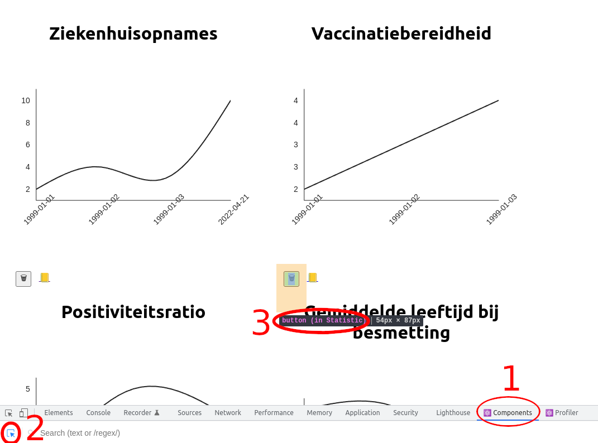
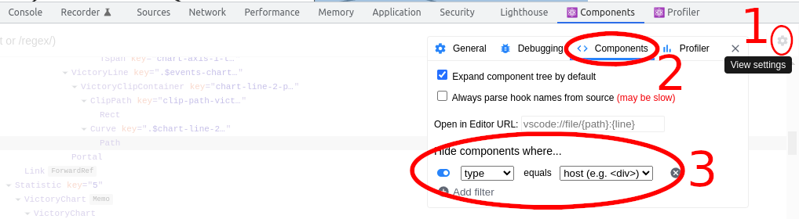
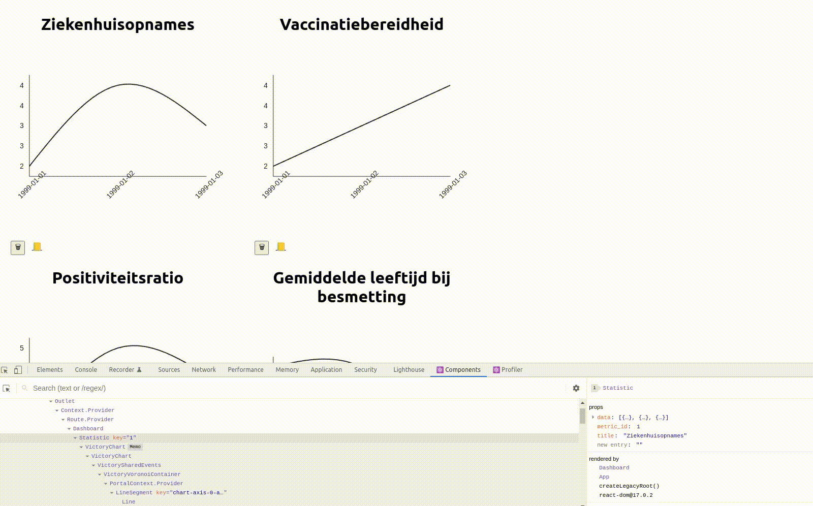

# React developer tools

Het eindproduct van een React applicatie is een gerenderde HTML-pagina. Deze kan je verder onderzoeken met de [browser developer tools](broken-reference), maar in React is het vaak interessanter om de werking op het niveau van componenten te onderzoeken. Hiervoor dienen de React developer tools.

### Installatie

In Chrome kan je de React developer tools installeren [op deze pagina](https://chrome.google.com/webstore/detail/react-developer-tools/fmkadmapgofadopljbjfkapdkoienihi?hl=nl), via de knop "toevoegen aan Chrome":

### Mogelijkheden

#### Renderers van HTML-elementen achterhalen

Via de developer tools kan je achterhalen welke component een bepaald HTML-element heeft gerenderd. Je doet dit door eerst de Chrome developer tools te openen. Vervolgens voer je volgende stappen uit:

1. Klik op "Components"
2. Klik op de knop om componenten te selecteren
3. Ga boven het HTML-element staan waarvan je de oorsprong wil achterhalen. Er verschijnt een tooltip die aangeeft welke component het HTML-element heeft gerenderd. In het voorbeeld is dit de `Statistic` component.

#### Componenten filteren

Het overzicht van gebruikte componenten kan druk zijn. Om de werking van een specifieke component te bestuderen, kan het nuttig zijn andere componenten tijdelijk te verbergen. Dit kan met behulp van filters:

Standaard wordt één groep componenten verborgen, namelijk de "host" componenten. Dit zijn componenten die rechtstreeks overeenstemmen met standaard HTML-tags. Dit is de belangrijkste filter. De tweede belangrijkste filter is de `name` filter. Hierbij kan je de naam meegeven van een component die je wil negeren. In de screenshot zou dit bijvoorbeeld `Statistic` kunnen zijn.

#### Props en state aanpassen

Met de developer tools kan je de props en interne toestand van een component aanpassen. Hiervoor selecteer je de component en pas je de data met de hand aan. Onderstaande screencast toont dit:

