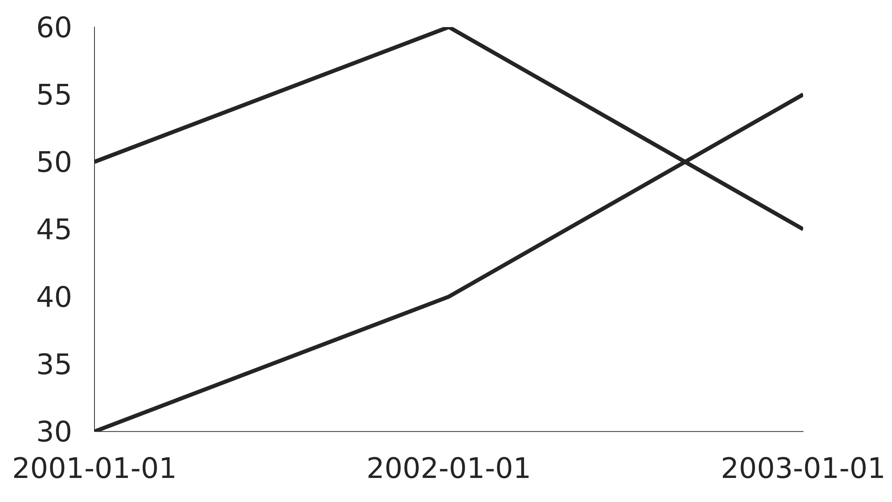
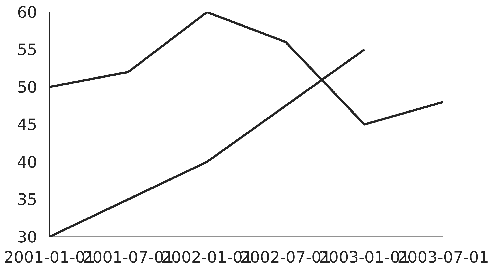
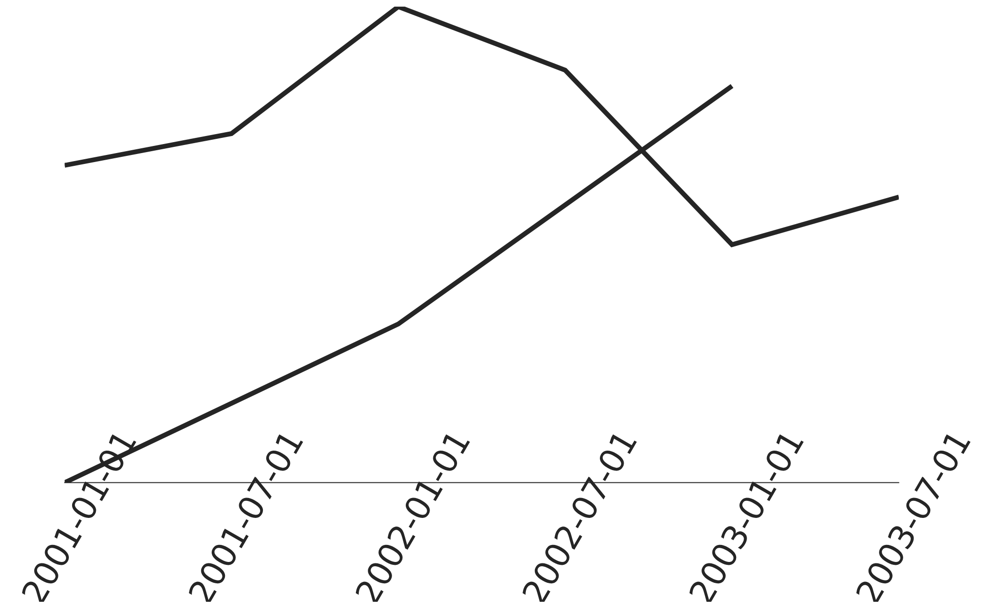
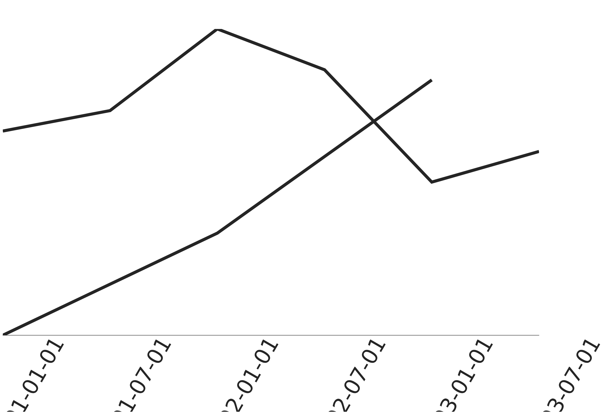
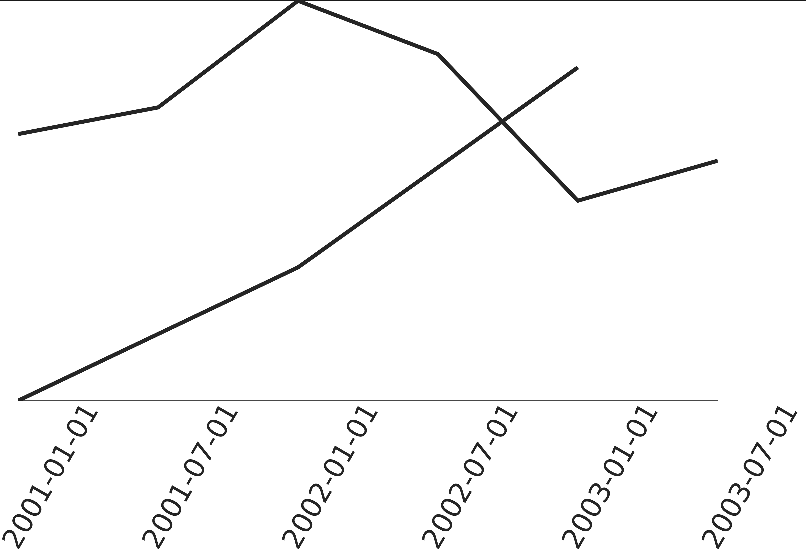
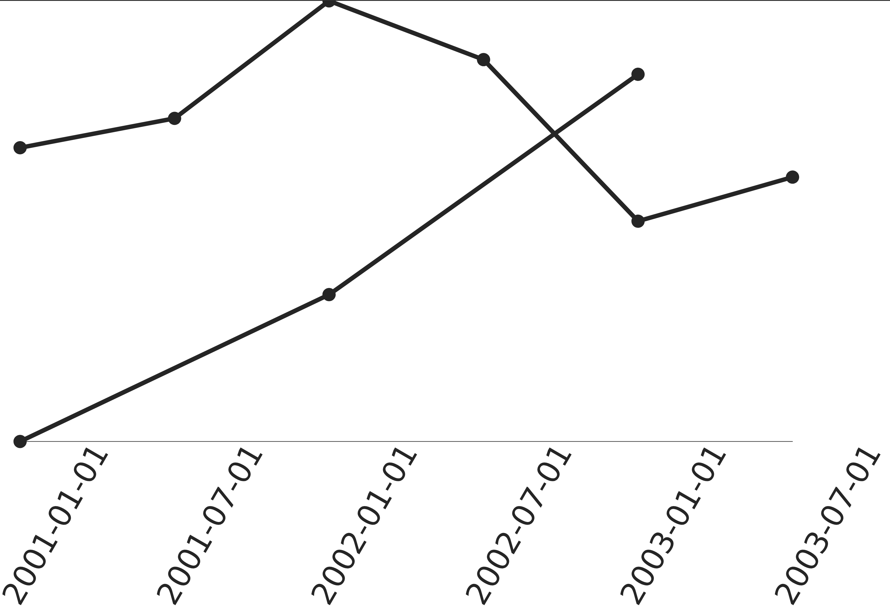
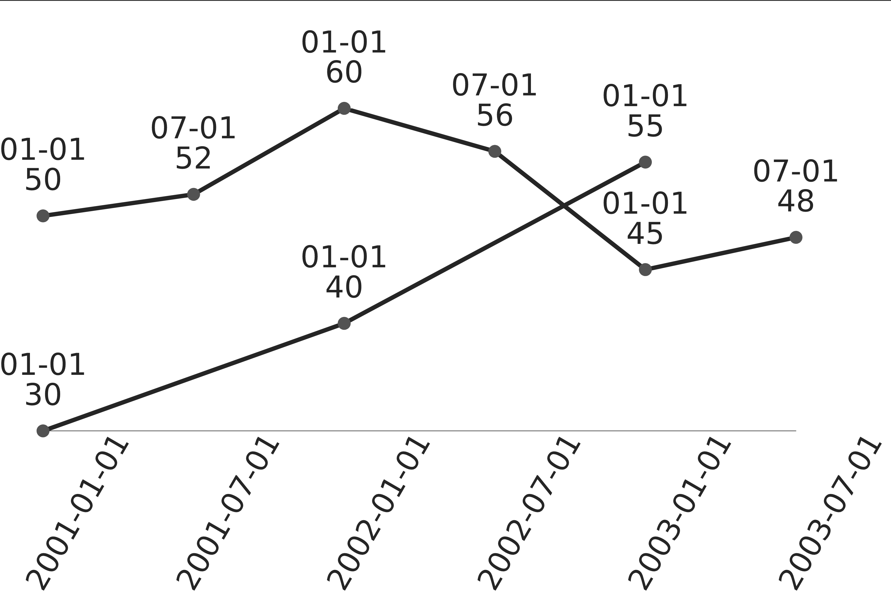

# lijngrafieken met Victory

Grafieken (taartdiagrammen, lijngrafieken, histogrammen,...) komen terug op heel veel websites.  Je mag dus veronderstellen dat er kant-en-klare componenten bestaan die het makkelijker maken om grafieken te tekenen. [Victory](https://formidable.com/open-source/victory/) is zo een bibliotheek van componenten die makkelijk te gebruiken is en heel veel functionaliteit bevat.


Om een beeld te krijgen van het soort grafieken dat je met Victory kan maken, moet je de [galerij](https://formidable.com/open-source/victory/gallery/) maar eens bekijken.



Victory is beschikbaar onder de [MIT-licentie](https://choosealicense.com/licenses/mit/).


## een simpel lijndiagram

Een lijndiagram is een tweedimensionale tekening waarop de evolutie van een waarde doorheen de tijd kan worden weergegeven. Een opgemeten waarde wordt bijna altijd uitgezet in de verticale richting (de "Y-as") en het tijdstip waarop de waarde is opgemeten wordt uitgezet in de andere, typisch horizontale, richting (de "X-as"). Onderstaande figuur toont dit:


We zullen hetzelfde type grafiek namaken met Victory. **Het wordt sterk aangeraden dat je de stappen mee volgt.** Onderaan de pagina vind je een implementatie met verschillende extra's.


Tussendoor geven we niet alle imports en zeggen we niet welke packages je moet installeren wanneer dit gekend zou moeten zijn. Probeer de code zelf aan de praat te krijgen.


#### installatie

Maak eerst een nieuw React.js project aan. Noem het `linechart`. Open het project in Visual Studio Code en installeer Victory via `npm install victory @36.5.3`.


Omdat Victory ingebouwde ondersteuning bevat voor TypeScript, hoef je geen extra types te installeren.


#### instantiatie line chart

We zullen voor onze eigen line chart een component maken. Plaats deze onder src/components/OwnLineChart.tsx:

```typescript
export function OwnLineChart() {
    return <p>Dit wordt straks een line chart.</p>;
}
```

Vervang nu de TSX-expressie in App.tsx door:

```
<div className="App">
  <OwnLineChart />
</div>
```

Start je applicatie. Je zou moeten zien dat de nieuwe component gebruikt wordt, ook al stelt hij nog niet veel voor.

Ga nu terug naar `OwnLineChart.tsx`. Definieer, **voor** de functie voor de component, een interface `DataPoint`, met properties `x` (van type `string`) en `y` (van type `number`).

Definieer daar onder, nog steeds **voor** de functie voor de component, een array met `DataPoint`-objecten:

```typescript
const dataPoints: DataPoint[] = [
  {x: '2001-01-01', y: 50},
  {x: '2002-01-01', y: 60},
  {x: '2003-01-01', y: 45}
];
```

Vervang nu de TSX-expressie voor de `OwnLineChart`-component door:

```typescript
<VictoryChart>
  <VictoryLine data={dataPoints}/>
y</VictoryChart>
```

Het buitenste deel, `VictoryChart`, stelt de volledige tekening voor. Alle componenten binnen één chart worden op hetzelfde assenstelsel getoond, met dezelfde algemene layout. Het binnenste deel, `VictoryLine`, stelt de lijn zelf voor. Het is hieraan dat we de data moeten meegeven, want als we twee datasets op dezelfde tekening plaatsen, hoort elke dataset bij een andere lijn.

In je applicatie zou je ongeveer het volgende moeten zien:

.png>)

Om aan te tonen welke rol `VictoryChart` speelt, zullen we nog een tweede lijn toevoegen:

```typescript
const otherDataPoints: DataPoint[] = [
    { x: '2001-01-01', y: 30 },
    { x: '2002-01-01', y: 40 },
    { x: '2003-01-01', y: 55 }
];
```

Voeg zelf de tweede lijn toe. Je zou iets zoals dit moeten zien:



#### verbetering layout

Als je te veel brede labels hebt, moet je deze anders weergeven. Pas eerst dataPoints aan als volgt:

```
const dataPoints: DataPoint[] = [
    { x: '2001-01-01', y: 50 },
    { x: '2001-07-01', y: 52 },
    { x: '2002-01-01', y: 60 },
    { x: '2002-07-01', y: 56 },
    { x: '2003-01-01', y: 45 },
    { x: '2003-07-01', y: 48 }
];
```

Je krijgt waarschijnlijk iets zoals hieronder:



Je kan de labels roteren om dit op te lossen. Dit doe je door de X-as uitdrukkelijk op te nemen binnen je `VictoryChart` en aan te geven hoe de labels precies werken. We willen dat labels voorgesteld worden via de kant-en-klare VictoryLabel component, maar met een hoek van -60 graden (dus een beetje minder dan een kwartslag tegen de klok in gedraaid):

```
<VictoryAxis tickLabelComponent={<VictoryLabel angle={-60} />}/>
```

Dit levert iets van volgende vorm:



Dit is een verbetering, maar het zou beter zijn als de labels niet op de tekening terecht kwamen. Daarom zullen we ze wat naar beneden opschuiven. Dat doen we via de properties `dx` en `dy`. Deze schuiven de tekst in de richting waarin hij loopt en loodrecht op die richting. Omdat we een hoek van 60 graden gebruiken, zorgt een wijziging voor dx dus meer voor een verschuiving in de verticale richting dan in de horizontale richting. **Experimenteer met kleine aanpassingen van elk van de drie properties als dit niet duidelijk is!**

Met `dx` gelijk aan `-15` en `dy` gelijk aan `20` zou je ongeveer dit moeten zien:



Een nieuw probleem is nu dat de labels buiten de grenzen van de hele tekening vallen. Om dat op te lossen, verschuiven we de grenzen door de `padding` property van de hele tekening in te stellen: `<VictoryChart padding={{left: 20, bottom: 100, right: 80}}>`.

Uiteindelijk krijg je dit:




In sommige situaties kan je het probleem van brede labels makkelijker oplossen via de property `fixLabelOverlap` van `VictoryAxis`. Die aanpak werkt echter niet in alle situaties.


#### discrete punten toevoegen

Een probleem met line charts is dat het niet altijd meteen duidelijk is waar de metingen precies zitten en welke onderdelen "geïnterpoleerd" zijn. Dat wil zeggen: automatisch ingevuld op basis van gekende informatie. Om dit duidelijk te maken, voegen we een scatter plot toe aan de grafiek. Dit is een ander type diagram, waarin elke waarde als een bolletje wordt aangeduid en waarbij de waarden niet verbonden zijn.

Voeg hiervoor gewoon volgende componenten toe na je `VictoryLine` componenten:

```
<VictoryScatter
  data={dataPoints} />
<VictoryScatter
  data={otherDataPoints} />
```

Dit levert je iets van volgend formaat:




Het bovenste bolletje wordt een beetje afgesneden. Je zou uit de eerdere instructies moeten kunnen afleiden hoe je dat kan vermijden.


Merk op: je kan de `VictoryLine` componenten gewoonweg verwijderen om enkel de scatter plots over te houden. Het gaat dus niet om een **aanpassing** aan de `VictoryLine` componenten, maar om een extra soort voorstelling die op dezelfde tekening wordt getoond.

We kunnen algemener aangeven dat meerdere voorstellingen voor dezelfde data dienen door de componenten in een `VictoryGroup` te zetten als volgt:

```
<VictoryGroup data={dataPoints}>
  <VictoryLine />
  <VictoryScatter />
</VictoryGroup>
```

Nu hoeven we de `data` property van de indviduele componenten dus niet meer in te vullen.

**Zet zelf de andere data ook in een groep.**

#### tooltips toevoegen

De line chart geeft een algemeen beeld, maar de waarde voor een specifieke datum aflezen is nog niet zo nauwkeurig. Zelfs als we de Y-as zichtbaar zouden maken zou dat het geval zijn. We kunnen van de lezer niet verwachten dat hij een liniaal tegen het scherm houdt. Daarom zullen we de waarde bij de datapunten tonen. Hiervoor gebruiken we de `labels` property van een groep. Deze verwacht een functie die een object met property `datum` (met daarin een datapunt) omzet in een string (die dan bij dat datapunt getoond zal worden). Voeg deze property toe aan je groepen: `labels={({ datum }) => ${(datum.x).substring(5)}\n${datum.y}}`. Hier is `datum` een datapunt. Je moet deze naam gebruiken, maar je kan hem eventueel wel wijzigen als volgt: `labels={({ datum: dataPoint }) => ${(dataPoint.x).substring(5)}\n${dataPoint.y}}`.

Nu krijg je dit:



Dit is beter af te lezen, maar is dan weer erg druk. We kunnen dit oplossen door middel van **tooltips**: tekstballonnetjes die verschijnen wanneer we over een bepaald datapunt bewegen. Deze vervangen het soort label dat we momenteel hebben (gewone tekstlabels), dus we passen dit aan via de labelComponent property van een `VictoryGroup`: `labelComponent={<VictoryTooltip/>}`. Merk op dat de eerdere `labels` component **blijft staan**! Dan krijg je uiteindelijk iets als dit (wanneer de cursor op het datapunt in kwestie staat):


Een kleine tekortkoming van deze tooltips is dat ze niet goed overweg kunnen met erg brede tekst. Je kan wel, zoals we hier ook gedaan hebben, tekst over meerdere regels splitsen.

Je zou nu een heleboel nuttige grafieken moeten kunnen maken met Victory en je bent ook beter voorbereid om zelf extra mogelijkheden op te zoeken in de officiële documentatie.
